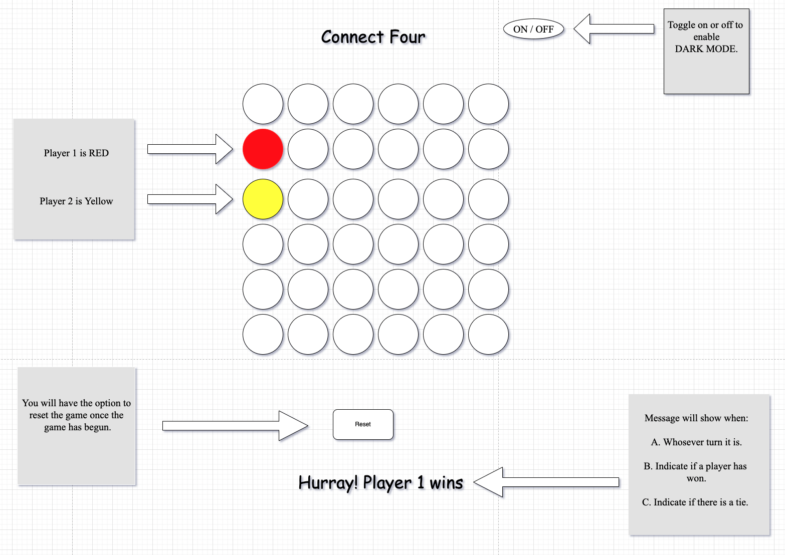
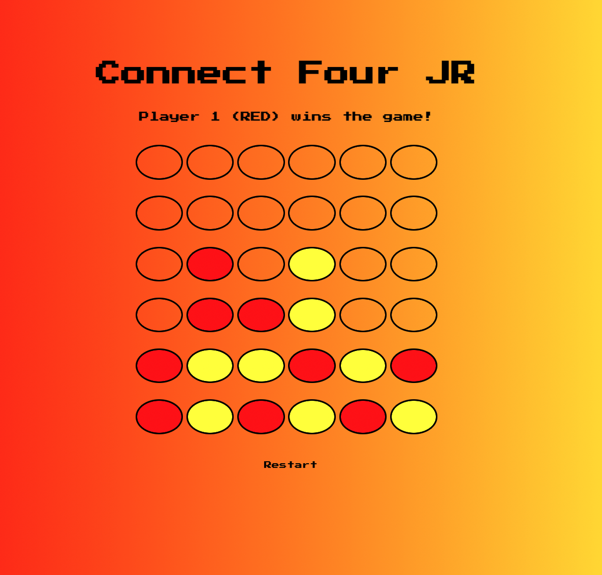

# Connect Four JR

# Background

**WELCOME TO MY GAME!!!!** Before we dive in, let's take a step back and remember the early days off Connect Four. It was in 1974 when Milton Bradley brought the plastic version of Connect Four to the masses creating a cultural phenomenon. Howard Wexler, a toy inventor, is given credit for creating the Connect Four we all grew up playing. Milton Bradly was eventually bought out by Hasbro who continues to sell the game.

# Getting Stared

### Instructions:

1. Player 1 will be RED - Player 2 will be YELLOW
2. Player 1 (RED) will go first.
3. Player 2 (YELLOW) will go second.
4. Take turns until one player gets four of his/her colored checkers in a row. 

If you're the first player to get four of your colored checkers in a row - horizontally, vertically, or diagonally **YOU WIN THE GAME!!.**

 <a href="https://jruizwk.github.io/connect-four/">LETS'S PLAY NOW!!</a>

# POINT A TO POINT B

# Technologies Used

   

   

   

# Credits

1. <a href="https://github.com/Ileriayo/markdown-badges">README.md Badges</a>
2. <a href="https://fonts.google.com/">Google Fonts</a>
3. <a href="https://animate.style/">Animate.CSS</a>

# Icebox (Future Enhacments)

1. The option to choose which colored checker you want to play with.
2. The option to choose who wants to go first.
3. Add confetti when a player has won the game.
4. Add sound effects.